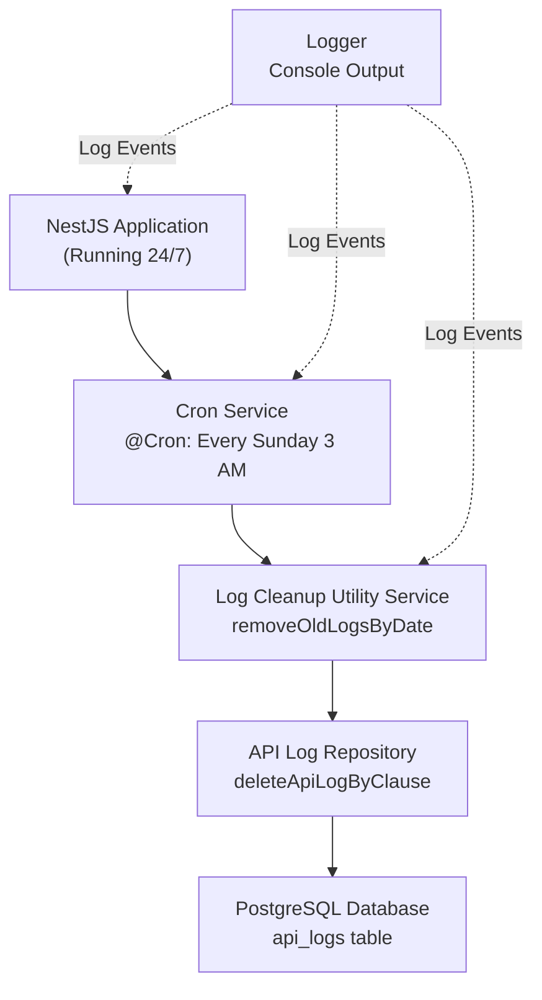
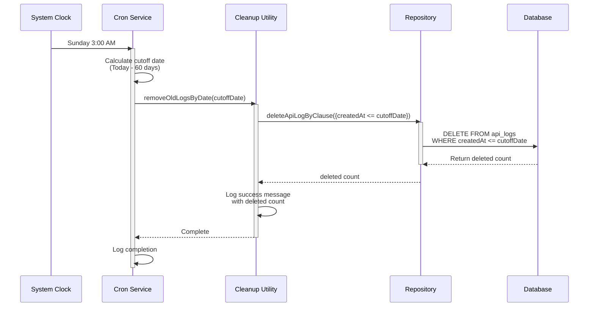
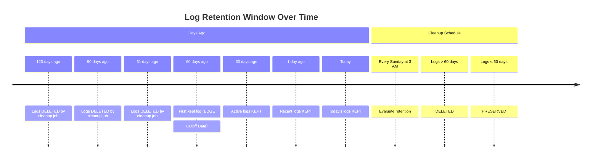
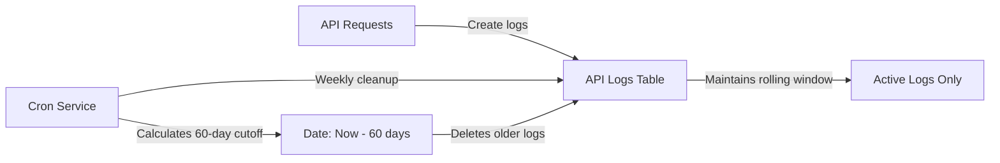

<p align="center">
  <a href="http://nestjs.com/" target="blank"></a>
</p>

[circleci-image]: https://img.shields.io/circleci/build/github/nestjs/nest/master?token=abc123def456
[circleci-url]: https://circleci.com/gh/nestjs/nest

  <p align="center">A progressive <a href="http://nodejs.org" target="_blank">Node.js</a> framework for building efficient and scalable server-side applications.</p>
    <p align="center">
<a href="https://www.npmjs.com/~nestjscore" target="_blank"></a>
<a href="https://www.npmjs.com/~nestjscore" target="_blank"></a>
<a href="https://www.npmjs.com/~nestjscore" target="_blank"></a>
<a href="https://circleci.com/gh/nestjs/nest" target="_blank"></a>
<a href="https://coveralls.io/github/nestjs/nest?branch=master" target="_blank"></a>
<a href="https://discord.gg/G7Qnnhy" target="_blank"></a>
<a href="https://opencollective.com/nest#backer" target="_blank"></a>
<a href="https://opencollective.com/nest#sponsor" target="_blank"></a>
  <a href="https://paypal.me/kamilmysliwiec" target="_blank"></a>
    <a href="https://opencollective.com/nest#sponsor"  target="_blank"></a>
  <a href="https://twitter.com/nestframework" target="_blank"></a>
</p>
  <!--[](https://opencollective.com/nest#backer)
  [](https://opencollective.com/nest#sponsor)-->

## Description

An automated API log retention system built with NestJS that periodically cleans up old logs from the database. This system runs on a scheduled cron job to maintain optimal database performance by removing logs older than the configured retention period.

### Key Features
- **Automated Cleanup**: Runs automatically on a weekly schedule (every Sunday at 3 AM)
- **Configurable Retention**: 60-day rolling retention window
- **Database Optimization**: Removes old logs to prevent unbounded database growth
- **Logging & Monitoring**: Detailed logs for each cleanup operation
- **Sequelize ORM**: Uses Sequelize for database operations

## Workflow Diagram

### System Architecture



### Cleanup Workflow Timeline



### 60-Day Retention Scenario



### Data Flow



## Installation

## Installation

```bash
$ pnpm install
```

## Database Setup

1. **Install PostgreSQL** and create a database for the application.

2. **Configure Environment Variables**
   - Copy `.env.example` to `.env`
   - Update the database configuration variables:
     ```
     DB_HOST=localhost
     DB_PORT=5432
     DB_USERNAME=your_postgres_username
     DB_PASSWORD=your_postgres_password
     DB_NAME=api_logs
     ```

3. **Run Database Migrations**
   ```bash
   # Create the database (if it doesn't exist)
   $ pnpm run db:create

   # Run migrations to create tables
   $ pnpm run db:migrate
   ```

4. **Generate New Migrations** (when you need to modify the database schema)
   ```bash
   $ pnpm run migration:generate -- migration_name
   ```

### Database Structure
Database-related files are organized in the `sequelize/` directory:
- `sequelize/config/` - Database configuration files
- `sequelize/migrations/` - Database migration files
- `sequelize/models/` - Sequelize model definitions
- `sequelize/seeders/` - Database seed files

## Running the app

```bash
# development
$ pnpm run start

# watch mode
$ pnpm run start:dev

# production mode
$ pnpm run start:prod
```

## Test

```bash
# unit tests
$ pnpm run test

# e2e tests
$ pnpm run test:e2e

# test coverage
$ pnpm run test:cov
```


## Stay in touch
Author - Sandip Das (Full Stack Developer | NodeJs | ReactJs | AWS)
Email - sandip4991@gmail.com
LinkedIn - https://www.linkedin.com/in/sandipdas-software/
